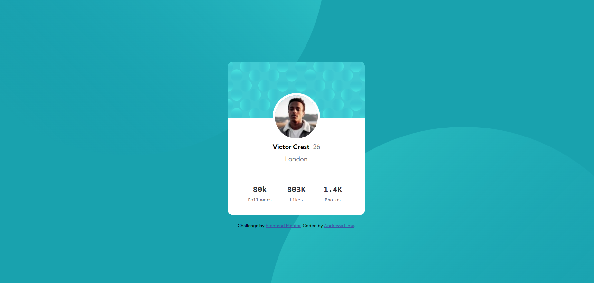
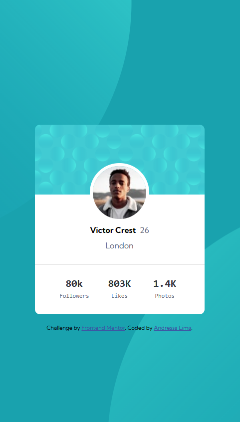

# ✨Project - Profile card component

## Welcome! 👋

Esta é uma solução do componente de cartão de perfil o desafio foi deixá-lo o mais próximo possível do design original. Os desafios do Frontend Mentor ajudam você a melhorar suas habilidades de codificação criando projetos realistas.

## Challenges 🚀

- O objetivo principal foi a criação de um componente card de perfil baseado em seu design de orientação ✅

- A página tem por finalidade a apresentação de um perfil de redes sociais ✅

- Os usuários devem ser capazes de: 
    - Exibir o layout ideal para a página, dependendo do tamanho da tela do dispositivo
    
    - Ver os estados de foco para todos os elementos interativos na página

- Criado com HTML e CSS ✅

### Screenshot (solution)

## My process 🚀

- Semantic HTML5 markup 👩‍💻

- CSS 👩‍💻

- Flexbox 👩‍💻

## Author

- Frontend Mentor - [@andressa-l](https://www.frontendmentor.io/profile/andressa-l)
